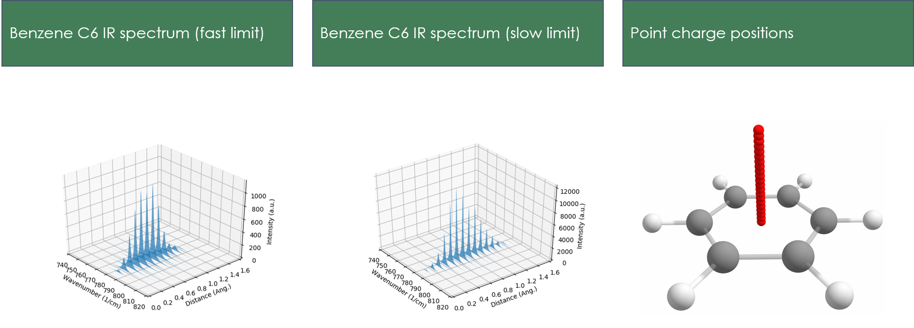
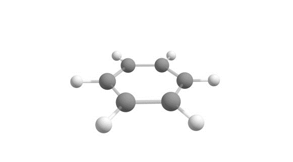
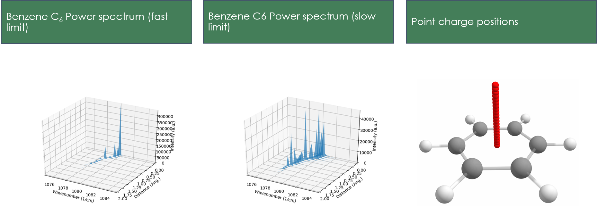

# NWChem_Scripts
Scripts built for either setting up NWChem inputs or preprocessing for inputs

#### Directories of interest:
- modified_qmd_source
  - Contains Fortran files for compiling the NWChem build needed to run our VEELS QMD simulations 
- point_charge_scan_numerical_template
  - Template for building directories for several QMD simulations at once, specifically simulating VEEL spectra for a given XYZ structure using forces produced by a point charge perturbation and computed using a central finite difference numerical method.
- point_charge_scan_analytical_template
  - Template for building directories for several QMD simulations at once, specifically simulating VEEL spectra for a given XYZ structure using forces produced by a point charge perturbation and computed using the analytical gradient machinery in NWChem.
- spectra_tools
  - Files necessary for creating dipole and power spectra from QMD output files.

### Example of vibrational response from scanning point charges along the C6 axis of benzene
</img> </img>
</img> </img>
